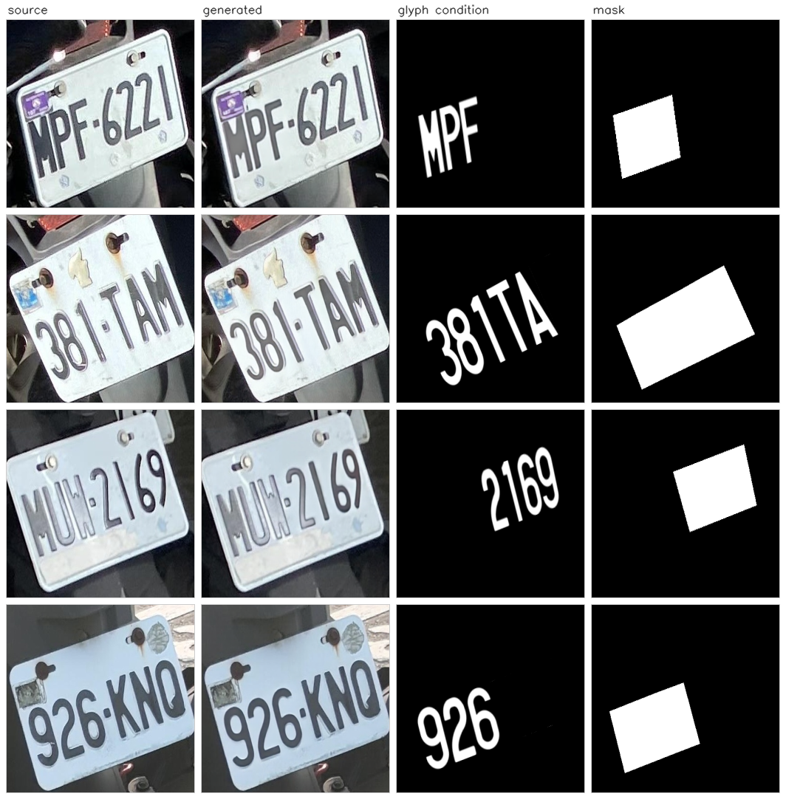

# LP2025 Partial License-Plate Editing

Style-preserving partial editing of Taiwanese license plates with a QLoRA-tuned
FLUX.1-Fill model. Given a plate photograph, a mask over one or more character
cells, and a rendered target glyph, the model repaints only the masked cells and
leaves the rest of the plate — its lighting, blur, plate frame, and background —
untouched.

This repository is the LP2025 half of the work: data preparation, training,
inference, and the three evaluation metrics used in the paper.



Four randomly drawn test samples, sharpest half of the split, shown without
cherry-picking: rows 1 and 3 reproduce the target text, rows 2 and 4 do not.
Measured over the full test split of 3,258 images: **ACC 0.8109, NED 0.9549**.

## What is here

```
configs/lp2025_train.yaml    training configuration, with the provenance of every value
scripts/check_data.py        verify a checkout before running anything
scripts/reproduce.sh         generate and evaluate in one go
scripts/build_cache.sh       encode a split into VAE latents + text embeddings
scripts/train.sh             fine-tune the LoRA adapter
scripts/infer.py             generate edited plates
scripts/eval_ocr.py          ACC / NED through a TRBA recogniser
scripts/eval_image.py        FID, full-image LPIPS, masked-region LPIPS
src/                         model, data, loss, and training code
docs/DATA.md                 dataset layout and how each split is built
docs/REPRODUCIBILITY.md      what is attested, what is inferred, and what is missing
docs/CHECKPOINTS.md          released weights and how the step was chosen
```

## Requirements

One NVIDIA GPU with 24 GB is enough for both training and inference; the
original run used a single RTX 4090 under CUDA 12.2 with Python 3.10.

```bash
conda create -n lp2025 python=3.10 -y
conda activate lp2025
pip install -r requirements.txt
```

Versions in `requirements.txt` are pinned to the ones recorded in the original
training environment. `diffusers==0.32.2` in particular is not interchangeable —
later releases changed the FLUX transformer's forward signature that
`src/flux/` patches.

## Setup

**1. Base model.** Download **FLUX.1 Fill [dev]** from Hugging Face in its normal
full-precision form. `src/train/model.py` quantises the transformer to NF4 at
load time through `BitsAndBytesConfig`, so no pre-quantised copy is needed:

```bash
export FLUX_DIR=./FLUX.1-Fill-dev
```

One caveat worth knowing before you compare numbers. The released adapter's model
card records `bnb_4bit_use_double_quant: false`, but the loader in this
repository sets it to `true`. The original run therefore quantised the base
slightly differently from what this code does now. Set it to `false` in
`src/train/model.py` if you want to match the released checkpoint's conditions
exactly.

**2. Weights.** See [weights/README.md](weights/README.md) for what to download,
where to put it, and SHA-256 checksums. Inference needs the adapter; `eval_ocr.py`
needs the recogniser; only training needs the ODM loss encoder.

**3. Data.** See [docs/DATA.md](docs/DATA.md). The layout is four parallel
directories keyed by a shared stem. Note where each split lives: the test split
sits at the archive root, train and val under `data/`.

```
LP2025/                          <- pass this as --data_root for the test split
    filtered_plate/              3,918 source crops
    partial_glyphs/              3,258
    partial_masks/               3,258
    partial_labels_txt/          3,258
    data/train/                  <- --data_root for training data (2,569)
    data/val/                    <- 620
```

Each split's four directories:

```
data/<split>/
    filtered_plate/       <stem>.jpg    source plate crop
    partial_masks/        <stem>.png    region to repaint, white = edit
    partial_glyphs/       <stem>.png    rendered target glyph
    partial_labels_txt/   <stem>.txt    target text
```

The test split names its source directory `cropped_plates_png_512/<stem>.png`
instead of `filtered_plate/`; `scripts/infer.py` accepts either.

| Split | Samples | Note |
|---|---:|---|
| train | 2,569 | |
| val | 620 | |
| test | 3,258 | sources in `filtered_plate/` (3,918, a superset) |

Check the checkout before spending GPU time on it:

```bash
python scripts/check_data.py --root /path/to/LP2025 --weights weights
```

It reports per-split counts and exits non-zero if a glyph has no source image or
a required weight is absent — both of which otherwise fail late and quietly.

## Reproduce the published numbers

```bash
bash scripts/reproduce.sh /path/to/LP2025 /path/to/deep-text-recognition-benchmark
```

Generation, then both evaluations. Expect **ACC 0.8109 / NED 0.9549** on the full
test split of 3,258 images. Generation runs at about 17 s per image on an RTX
4090, so the full split takes roughly 15 hours; set `LIMIT=50` to sample first.

## Train

```bash
bash scripts/build_cache.sh          # ~25 min for the training split on a 4090
bash scripts/train.sh configs/lp2025_train.yaml
```

Training reads the cache, not the images, and the mask is baked into the cached
tokens — so a cache built for one mask set cannot be reused for another.

Batch size is 1, so one epoch is 2,569 steps. The released checkpoint is step
27,606, about epoch 10–11. The original run continued to 43,784 steps without
improving validation loss; see [docs/CHECKPOINTS.md](docs/CHECKPOINTS.md) before
deciding to train longer.

## Generate

```bash
python scripts/infer.py \
    --data_root data/test \
    --config configs/lp2025_train.yaml \
    --lora weights/lp2025_27606/adapter_model.safetensors \
    --flux_dir $FLUX_DIR \
    --out outputs/lp2025_test \
    --compare
```

## Evaluate

```bash
# text accuracy — needs a clone of deep-text-recognition-benchmark
python scripts/eval_ocr.py \
    --image_folder outputs/lp2025_test \
    --saved_model weights/trba_lp2025/best_accuracy.pth \
    --dtr_root ../deep-text-recognition-benchmark
# on the released checkpoint's test outputs: n = 3258, ACC = 0.8109, NED = 0.9549

# image fidelity
python scripts/eval_image.py \
    --gen_dir outputs/lp2025_test \
    --real_dir data/test/filtered_plate \
    --mask_dir data/test/partial_masks
```

### Verified against the published numbers

Scoring the released checkpoint's own test outputs with the scripts in this
repository:

| Metric | Published | This repository |
|---|---:|---:|
| FID ↓ | 4.78 | 4.2050 |
| Full LPIPS ↓ | 0.081 | 0.0790 |
| Region LPIPS ↓ | 0.062 | 0.0648 |
| ACC ↑ | 0.801 | 0.8106 |
| NED ↑ | 0.952 | 0.9547 |

n = 3,258. The residual spread is generation randomness, not a difference in
measurement: the original inference script seeded neither the diffusion
generator nor the choice of prompt template, so two runs of the same checkpoint
produce different images and land about a point apart in ACC. `scripts/infer.py`
seeds both, which makes a run here reproducible but means it will not land
exactly on a number produced by an unseeded run.

Cross-checked against the project's own scorer: `trba_accned.py` gives
ACC 0.8106 / NED 0.9547 on the same images, against 0.8109 / 0.9549 from
`scripts/eval_ocr.py` — a one-image difference out of 3,258.

### Reading the metrics

Two of these numbers are routinely misread, so state them carefully:

**FID is not comparable across sample sizes.** It falls as N grows. On one fixed
image set we measured 7.28 at N=200 against 3.85 at N=1,000 — a factor of two
from sample size alone. Only compare FID values computed at the same N, and
always report N.

**Region LPIPS depends entirely on how "region" is defined.** Here both images
are multiplied by the mask and LPIPS is taken over the full 512x512 result, which
is the definition behind the published numbers. Cropping to the mask instead
gives 0.22 on the same images where this gives 0.065 — a factor of three, because
a crop discards the large identical area that otherwise dominates the score.
Never compare a region LPIPS against one computed by a different convention.

It is also a quality measure only for reconstruction. When the target text equals
the original text there is a ground-truth image and lower is better. When
characters were deliberately replaced, the edited region is *supposed* to differ
from the source, so the value carries no quality information. Pass `--edit` and
the output says so.

**ACC is a lower bound, not an estimate.** The recogniser errs in one direction:
in a 409-sample human study on the CCPD extension of this work it never credited
a wrong character, but it missed 129 correct ones. Treat reported accuracy as a
floor on what the generator produced.

## Reproducibility

The original training run's directory was deleted; its wandb record survived.
[docs/REPRODUCIBILITY.md](docs/REPRODUCIBILITY.md) marks every configuration
value as attested, inferred, or missing, so anyone reproducing this knows which
numbers are documented and which are reconstructed. Two blocks — the ODM loss
weights and the optimiser's secondary parameters — are taken from the same
script's nearest surviving configuration rather than from that run.

## Citation

<!-- Fill in once the paper reference is final. -->

## License

The base model, FLUX.1-Fill-dev, is distributed by Black Forest Labs on Hugging
Face under the FLUX.1 [dev] Non-Commercial License. That license governs the
weights you download and the outputs you generate with them, independently of
this repository — in particular it rules out commercial use. Read it before
using anything here in a product.

No license is declared for the code in this repository.
