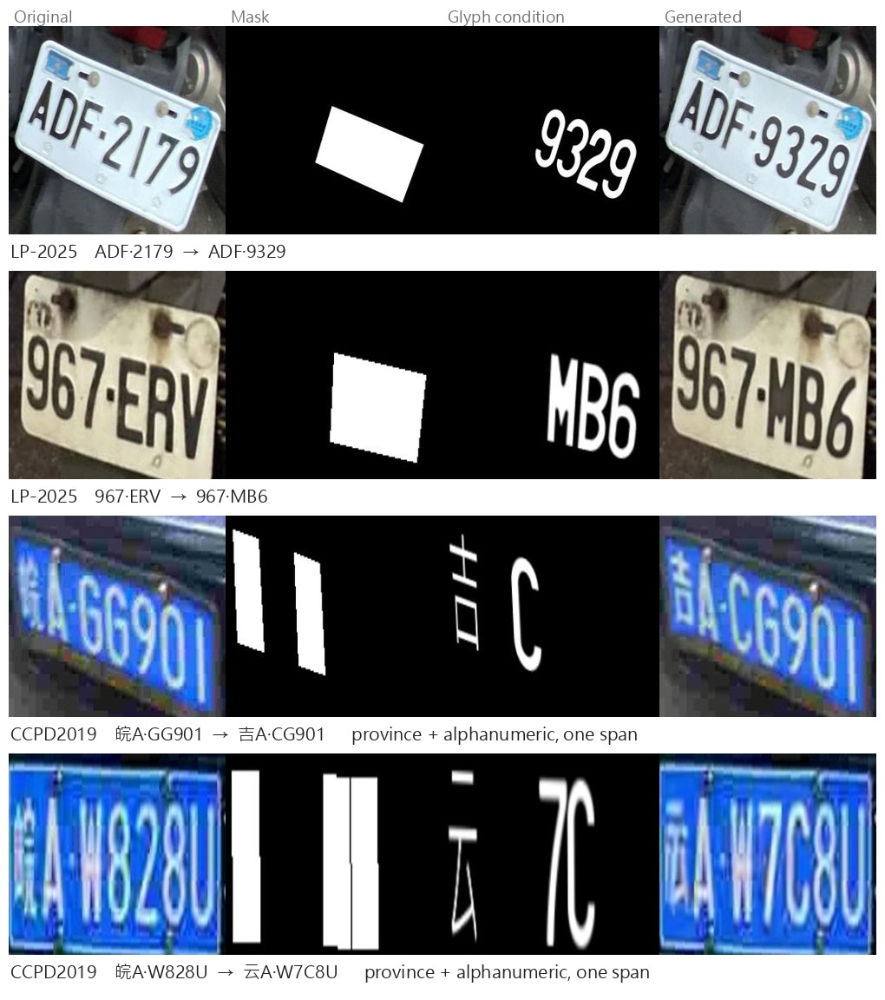

# StylePlate — Style-Preserving Partial License-Plate Editing

Repaint a chosen span of characters on a licence plate while keeping the plate's
own background, blur, illumination and stroke weight. Two datasets are supported
end to end: **LP-2025** (Taiwan, alphanumeric) and **CCPD2019** (China, one Chinese
province character followed by six alphanumerics).

CCPD editing is not split into "Chinese" and "alphanumeric" modes — one contiguous
span may cross the province boundary, so `皖A·GG901 → 吉A·CG901` is a single edit.



StylePlate is a derivative of [FLUX-Text](https://github.com/AMAP-ML/FluxText), not
a fork and not affiliated with it. The layout is kept close to upstream so the
directories mean the same thing in both.

---

## Where things are

| | LP-2025 | CCPD2019 |
|---|---|---|
| Inference | `eval/lp/infer.py` · `lp_edit.py` | `eval/ccpd/mixed_span_edit.py` |
| Training | `train/script/train_lp_stage{1,2}.sh` | `train/script/train_ccpd_stage{1,2}.sh` |
| Configs | `train/config/lp/` | `train/config/ccpd/` |
| Cache | `train/script/build_cache_stage1.sh` · `build_cache.sh` | `build_cache_stage1.sh` · `cn_preprocess.py` |
| Prepare your own plates | `eval/lp/prepare_sample.py` · `train/script/annotate_lp.py` | `train/script/crop_plates_from_base.py` · `eval/ccpd/build_ccpd_conditions.py` |
| Synthetic data | `synth/tw/` | `synth/cn/` |
| Scoring | `eval/eval_image.py` · `eval/eval_ocr.py` | + `eval/ccpd/eval_ccpd.py` |

Docs: [downloads](docs/CHECKPOINTS.md) · [data layout](docs/DATA.md) ·
[evaluation](docs/EVALUATION.md) · [LP annotation](docs/ANNOTATION.md) ·
[recognisers](docs/RECOGNIZER.md) · [synthesis](synth/README.md)

## 🛠️ Installation

```bash
conda create -n flux_text python=3.10
conda activate flux_text
pip install -r requirements.txt
```

`diffusers` is pinned to **0.32.2** — later releases dropped `USE_PEFT_BACKEND`,
which `src/flux/` needs.

Then download the base model, checkpoints and data — [docs/CHECKPOINTS.md](docs/CHECKPOINTS.md) lists every asset and where it goes.
`weights/flux_base` is FLUX.1-Fill-dev from
[HuggingFace](https://huggingface.co/black-forest-labs/FLUX.1-Fill-dev), quantised
to NF4 on load — a pre-quantised copy is not needed.

## 📦 Datasets

| | Full dataset | What this project used |
|---|---|---|
| LP-2025 | [AvLab-CV/LP2025](https://github.com/AvLab-CV/LP2025) | 2,569 train · 620 val · 3,258 test |
| CCPD2019 | [detectRecog/CCPD](https://github.com/detectRecog/CCPD) | 1,777 train (province-balanced) · 90 val · 1,000 test |

Both subsets, with their masks, glyphs and labels, are release assets. **Download
them rather than rebuilding** if you want to reproduce the published numbers: the
geometry is exact, but both builders draw the masked span at random and the
original seeds were not recorded, so a rebuild measures a different set of edits.

Synthetic stage-1 data is not published — generate it with `synth/`.

## 🤗 Checkpoints

| | Stage 1 | Stage 2 | Trained on |
|---|---|---|---|
| LP-2025 | `lp_stage1_ckpt_21250` | **`lp_stage2_ckpt_27606`** | 20,000 synth / 1,000 val → 2,569 real / 620 val |
| CCPD2019 | `ccpd_stage1_ckpt_20000` | **`ccpd_stage2_ckpt_10000`** | 20,000 synth / 500 val → 1,777 balanced / 90 val |

Bold entries are the released checkpoints the published numbers come from. All are
rank-32 QLoRA adapters over NF4-quantised FLUX.1-Fill-dev. Also released:
`odm_epoch_100.pt` (perceptual loss, used by every run), `trba_lp2025` and
`trba_ccpd_final` (recognisers for scoring), and the DeepSolo++ detector used to
annotate LP photographs.

## 🔥 Quick start

```bash
# LP -- reconstruct the test split with the released checkpoint
python eval/lp/infer.py --data_root data/lp/test --config train/config/lp/lp2025_train.yaml \
    --lora weights/lp_stage2_ckpt_27606/adapter_model.safetensors \
    --flux_dir weights/flux_base --out outputs/lp_recon --limit 3 --compare

# LP -- replace characters
python eval/lp/lp_edit.py --target_mode edit --lp_root data/lp/test \
    --lora weights/lp_stage2_ckpt_27606/adapter_model.safetensors \
    --flux_dir weights/flux_base --max_span 2 --limit 100 --out outputs/lp_edit

# CCPD -- province and alphanumeric in one span (--dry_run previews without a GPU)
python eval/ccpd/mixed_span_edit.py --target_mode edit --span_mode cross --max_k 3 \
    --lora weights/ccpd_stage2_ckpt_10000/adapter_model.safetensors \
    --flux_dir weights/flux_base --limit 200 --out outputs/ccpd_edit
```

`ccpd_cn_edit.py` (province only) and `ccpd_latin_edit.py` (alphanumeric only)
remain available for ablations.

**Your own plate.** Supply the crop, the text it shows and the four corners of the
text region:

```bash
python eval/lp/prepare_sample.py --image my_plate.jpg --text RBE8700 \
    --quad "16,21 8,68 172,101 180,52" --span 3:6 --target 999 \
    --font font/TWGen7_V1.ttf --out data/mine --stem my_plate
```

The target must have the same character count as the span it replaces.

## 💪🏻 Training

Two stages for both datasets: synthetic pretraining with Prodigy, then real-data
fine-tuning with AdamW. Prodigy destabilises when warm-started from a converged
checkpoint, which is why stage 2 switches optimiser.

```bash
# 1. cache  (each sample is ~9.45 MB, mostly the T5 embedding -- check free space)
STAGE1_DATA=<generated dir> bash train/script/build_cache_stage1.sh lp
PP_PROVINCE_PROB=0.5 STAGE1_DATA=<generated dir> \
    bash train/script/build_cache_stage1.sh ccpd
bash train/script/build_cache.sh                                   # LP stage 2
python train/script/cn_preprocess.py --src data/ccpd/crops \
    --out cache/ccpd_stage2_train --province_ratio 0.5 --max_k 2   # CCPD stage 2

# 2. train
bash train/script/train_lp_stage1.sh           # 24 GB; _h100.sh is the published batch-8 recipe
bash train/script/train_lp_stage2.sh
bash train/script/train_ccpd_stage1.sh
bash train/script/train_ccpd_stage2.sh
```

Set `reuse_lora_path` in the stage-2 config first. `WANDB_API_KEY` comes from the
environment or `~/.netrc`; without one, training runs and logging is skipped.

**GPU memory.** LP stage 1 as published ran on an H100 at batch 8, which does not
fit 24 GB. `train_lp_stage1.sh` uses batch 1 × accum 64 — same effective batch
of 64, same 2,656 optimizer steps, measured 4.167 s/batch, about 8.8 days.

**Steps count batches, not optimizer updates.** `ckpt/21250` is 21,250 batches; at
batch 8 that is 170,000 image-views, and the same point at batch 1 is `ckpt/170000`.

## 📊 Evaluation

See [docs/EVALUATION.md](docs/EVALUATION.md) for commands, full result tables, and
three definitional traps that change the numbers by up to 10× on identical images.

Headline: LP reaches FID 5.39 / ACC 0.808 against 6.56 / 0.638 for real data alone.
CCPD province reconstruction reaches ACC 0.9920 against a real-photograph ceiling
of 0.9960. Province balancing lifts cross-province replacement from 0.4400 to
0.8000 using under a quarter of the data.

## Scope

* LP-2025 ships plate strings but no geometry, so annotation needs a text detector
  — both stages are here, see [docs/ANNOTATION.md](docs/ANNOTATION.md). CCPD needs
  none: its filename carries the four vertices.
* SynthText backgrounds (~9 GB) are downloaded, not redistributed — [synth/README.md](synth/README.md).
* Stage-1 LP synthetic indices 0000–1337 were regenerated after a path error;
  statistically equivalent, not bit-identical to the published run.

## 🌹 Acknowledgement

Built on [FLUX-Text](https://github.com/AMAP-ML/FluxText) and
[FLUX.1-Fill-dev](https://huggingface.co/black-forest-labs/FLUX.1-Fill-dev).
Text detection uses [DeepSolo++](https://github.com/ViTAE-Transformer/DeepSolo);
recognition scoring uses [deep-text-recognition-benchmark](https://github.com/clovaai/deep-text-recognition-benchmark);
synthetic backgrounds come from [SynthText](https://github.com/ankush-me/SynthText).
Datasets: [CCPD2019](https://github.com/detectRecog/CCPD), [LP-2025](https://github.com/AvLab-CV/LP2025).

## 📚 Citation

```bibtex
@mastersthesis{styleplate2026,
  title  = {Style-Preserving Partial License Plate Editing},
  school = {National Taiwan University},
  year   = {2026}
}
```

## License

Original work in this repository is MIT — see [LICENSE](LICENSE), which also lists
the terms of the third-party code, weights, fonts and datasets redistributed or
linked here.

Released model weights are LoRA adapters over FLUX.1-Fill-dev and inherit its
**non-commercial** terms, which also cover images generated with them.
